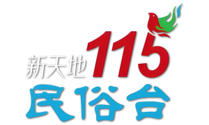

# 【台湾频道二】台标 PNG 文件

| 频道名           |             台标图片             | 频道名          |              台标图片              |
| :--------------- | :------------------------------: | :-------------- | :--------------------------------: |
| 艾尔达综合       |       | 艾尔达影剧      |         |
| 艾尔达娱乐       |       | 艾尔达体育-1    |         |
| 艾尔达体育-2     |       | 艾尔达体育-3    |         |
| 艾尔达生活英语   |       | 艾尔达奥运-1    |         |
| 艾尔达奥运-2     |       | 艾尔达奥运-3    |        |
| 艾尔达原音-1     |      | 艾尔达原音-2    |        |
| 艾尔达原音-3     |      | 靖天综合台      |     |
| 靖天资讯台       |   | 靖天映画台      |     |
| 靖天娱乐台       |   | 靖天育乐台      |     |
| 靖天日本台       |   | 靖天卡通台      |     |
| 靖天戏剧台       |   | 靖天电影台      |     |
| 靖天国际台       |  | 靖洋卡通台      |           |
| 靖洋戏剧台       |         | 纬来综合        |    |
| 纬来电影         |  | 纬来戏剧        |    |
| 纬来精采         |  | 纬来日本        |    |
| 纬来育乐         |  | 纬来体育        |    |
| Catchplay 电影台 |  | CatchplayBeyond |    |
| 天映频道         |        | 天映经典频道    |        |
| 卫视中文台       |     | 卫视电影台      |       |
| 卫视卡式台       |     | 星卫娱乐台      |      |
| 星卫 HD 电影台   |    | 国会频道-1      |       |
| 国会频道-2       |     | 冠军梦想        |     |
| 冠军 No1         |  | JET 综合台      |           |
| 东风卫视         |    | 国兴卫视        |          |
| 客家电视         |       | 原住民电视      |          |
| 新唐人亚太台     |         | 海豚电视台      |        |
| 双子卫视         |    | 番薯电视        |      |
| 美好电视         |        | 信大电视        |       |
| 全大电视         |    | 大立电视        |        |
| 正德电视         |     | 信吉卫视        |          |
| 诚心电视         |  | 人间卫视        |          |
| 生命电视         |   | 天良电视        |   |
| 唯心电视         |        | 华藏电视        |          |
| 十方法界         |        | 佛卫慈悲台      |          |
| 希望电视         |      | 视纳华仁纪实台  |          |
| 美亚电影台       |     | 龙祥时代电影台  |        |
| 采昌影剧台       |    | 狼谷育乐台      |  |
| 亚洲旅游台       |  | 金光布袋戏      |         |
| 霹雳台湾台       |       | Animax          |        |
| 曼迪日本台       |       | 韩国育乐台      |      |
| 时尚运动 X       |       | 美食星球        |    |
| 知识频道         |     | 车迷频道        |       |
| 幸福空间居家     |    | 空中英语教室    |        |
| LiveABC 互动英语 |     | 智林体育        |           |
| 美丽人生台       |     | ETtoday 综合台  |       |
| 台湾艺术台       |        | 世界电视台      |       |
| 富立电视台       |      | 新天地民俗台    |        |
| 三圣电视台       |  | 天美丽电视台    |         |
| 台湾综合台       |    | 天天电视台      |      |
| 台湾戏剧台       |  | 世新综合        |     |
| 威达超舜         |       |
